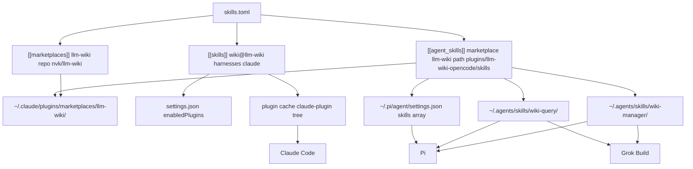
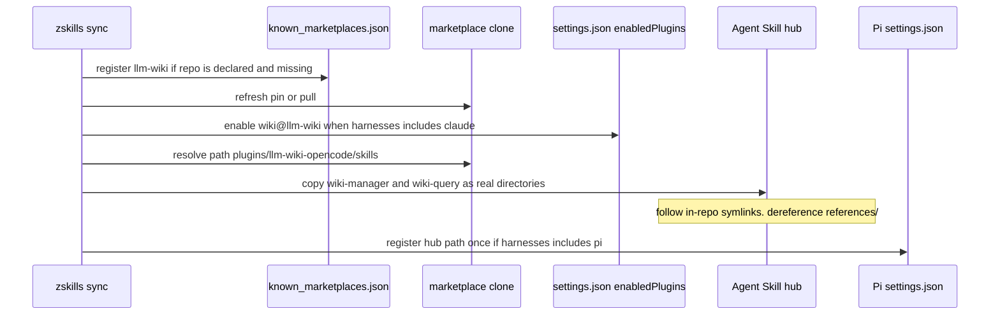

# Design: Path selectors for multi-packaging source repos (llm-wiki × Claude, Pi, Grok)

| Field | Value |
|---|---|
| Author | zskills maintainers (sign the GitHub issue with the filing author) |
| Date | 2026-08-29 |
| Status | Implemented on `main` (PRs #63–#69) |
| Audience | zskills maintainers |
| Depends on | [#51](https://github.com/zot24/zskills/issues/51) marketplace source in the manifest |
| Related | [#53](https://github.com/zot24/zskills/issues/53), [#54](https://github.com/zot24/zskills/issues/54), [#55](https://github.com/zot24/zskills/issues/55)/[#56](https://github.com/zot24/zskills/pull/56) (merged) |

---

## Overview

`nvk/llm-wiki` is one **source repo** that ships several packaging trees for one knowledge model. Claude Code consumes a marketplace plugin (`wiki` from `./claude-plugin`: 28 `/wiki:*` slash commands, nested `wiki-manager` Agent Skill, `bin/llm-wiki`). Pi and Grok do not load that plugin. They load Agent Skills. The source repo already contains the Pi/OpenCode rewrite at `plugins/llm-wiki-opencode/skills/` (`wiki-manager` without slash-command language, plus read-only `wiki-query`).

zskills today can register the marketplace and enable the Claude plugin. When `harnesses` includes `pi` or `grok`, it copies nested `skills/` out of **the Claude plugin**, so Pi and Grok see Claude-flavored `wiki-manager` (it talks about `/wiki:*`) and never see `wiki-query`. `skills_in_cache()` only walks `.agents/skills` and `skills/` at the clone root, so `zskills skill install nvk/llm-wiki` finds **zero** Agent Skills.

This design extends the existing three primitives — `[[marketplaces]]`, `[[skills]]`, `[[agent_skills]]` — with a relative `path` selector and a `marketplace` back-reference on `[[agent_skills]]`. After the source repo is cloned once as a marketplace, the manifest names the Claude plugin tree and the Agent Skill tree separately. `sync` maintains all three harnesses the user actually uses: Claude Code, Pi, Grok Build. No fourth primitive.

Target shape:

```toml
[[marketplaces]]
name = "llm-wiki"
repo = "nvk/llm-wiki"          # #51 — required so a fresh machine can clone
pin  = "v0.24.4"

[[skills]]
name = "wiki"
marketplace = "llm-wiki"
harnesses = ["claude"]         # plugin: slash commands + nested skill. Not the hub.

[[agent_skills]]
marketplace = "llm-wiki"       # reuse the marketplace clone — do not clone twice
path = "plugins/llm-wiki-opencode/skills"
name = "wiki-manager"          # or `skills = ["wiki-manager", "wiki-query"]` after #54
harnesses = ["pi", "grok"]
```

---

## Background & Motivation

### Why this change is needed

The user wants llm-wiki declared in the manifest, not ad-hoc copies, and visible to Claude Code, Pi (`@mariozechner/pi-coding-agent`), and Grok Build. They observed there is no official Pi plugin install, but the source repo already ships per-harness trees. They asked whether zskills can be configured with **paths into a cloned marketplace/source repo** so Pi and Grok get the right surface.

That is not a stretch of vocabulary. A plugin and an Agent Skill are different things. llm-wiki is a source repo that contains both.

### Current state (verified in code and in the clone at `~/.claude/plugins/marketplaces/llm-wiki`)

| Step the user runs | What zskills does | What the three harnesses actually get |
|---|---|---|
| `marketplace add nvk/llm-wiki` | Clones into `~/.claude/plugins/marketplaces/llm-wiki/`, writes `known_marketplaces.json` + `extraKnownMarketplaces`. Since #56, prints `1 plugin: wiki` and `Next: zskills plugin install wiki@llm-wiki`. Does not write the manifest. | Nothing is enabled. |
| `plugin install wiki@llm-wiki` | Flips `enabledPlugins`. Fetches via `claude plugin install -s user`. Default harnesses = Claude only. | Claude: `/wiki:*` + nested `wiki-manager`. Pi/Grok: nothing. |
| `[[skills]]` with `harnesses = ["claude", "pi"]` | `materialize_hub` → `plugin_skill_trees` (`src/harness.rs`) copies `claude-plugin/skills/wiki-manager/` into `~/.agents/skills/wiki-manager/`. `register_pi_hub` lists the hub in `~/.pi/agent/settings.json` `skills: []`. | Pi/Grok: Claude-flavored `wiki-manager`. No `wiki-query`. Slash commands stay Claude-only. |
| `skill install nvk/llm-wiki` | `repo_scanner::survey` sees `.claude-plugin/marketplace.json` and **redirects** to `marketplace add`. `skills_in_cache` walks only `.agents/skills` and `skills/` (`src/agent_skill.rs` `SKILL_ROOTS`). llm-wiki has neither at repo root. `.agents/plugins/` is Codex-only. | Zero Agent Skills installed. |

`plugin_skill_trees` is not "failing to find" llm-wiki's nested skill. The Claude plugin files `skills/wiki-manager/SKILL.md` one directory deep, so the one-level walk succeeds. The bug for this source repo is **the wrong tree**, plus **a second skill that does not exist in the Claude plugin**. Issue #53 (categorised plugins such as `mattpocock/skills`) is a different bug and stays a different PR.

### Pain points

1. One clone, several packaging trees, and zskills can only name the Claude marketplace plugin.
2. Fanning a plugin to Pi/Grok copies the Claude nested skill, which is the wrong flavour for those harnesses.
3. `skills_in_cache` cannot see `plugins/llm-wiki-opencode/skills/` or `claude-plugin/skills/`.
4. `[[marketplaces]]` still cannot declare `repo` (#51), so `sync` on a fresh machine cannot recreate the clone that a path selector would read.
5. Two clones would drift: marketplace clone under `~/.claude/plugins/marketplaces/llm-wiki/` vs Agent Skill cache under `$XDG_CACHE_HOME/zskills/agent-skills/nvk-llm-wiki/`. Pins live only on the marketplace today.

---

## Goals & Non-Goals

### Goals

- Declare, in `skills.toml`, which tree in a cloned source repo is the Claude plugin and which tree(s) are Agent Skills for Pi and Grok.
- Clone the source repo **once** (the marketplace clone) and copy from path selectors inside it.
- Materialize OpenCode/Pi `wiki-manager` and `wiki-query` into `~/.agents/skills/<name>/` as real directories (existing hub copy rule).
- Keep Claude's plugin surface intact: `enabledPlugins`, slash commands, nested skill inside the plugin cache, `bin/llm-wiki`.
- Follow in-repo relative symlinks when copying a skill tree (OpenCode `references/` → Claude `references/`), using an `allowed_root` of the clone.
- Refuse path traversal. Tests use `CLAUDE_HOME` / `AGENTS_HOME` / `PI_HOME` / `GROK_HOME`, never the developer's real `~/.claude`.
- Classify `[[agent_skills]]` rows by kind so marketplace+path never hits the local-only apply arm.
- Take over same-marketplace `plugin:` hub copies so an existing Claude-flavored `wiki-manager` becomes OpenCode on `sync`.
- Ship as independently mergeable PRs. Open an issue before non-trivial work.

### Non-Goals

- **Codex as a required target.** Codex packaging (`plugins/llm-wiki/`, `.agents/plugins/marketplace.json`, `@wiki` / `$wiki-query`) is cited only so we do not treat `.agents/plugins` as an Agent Skill root.
- **Pi query-lite launcher** (`scripts/pi-wiki-query`, `scripts/pi-ds4-wiki-query`). Those wrap `pi --no-skills --append-system-prompt profiles/query-lite/SKILL.md --tools read,grep,find,ls`. That is a launcher, not an Agent Skill install. Out of scope.
- **A Grok plugin adapter.** Decided: hub Agent Skills only. zskills does not write `~/.grok/config.toml` (`Harness::Grok.mcp_skip_reason` = `runtime CLI owns ~/.grok/config.toml`). llm-wiki ships no `.grok-plugin/marketplace.json`. Do not add `grok plugin marketplace add` in this series. A later `grok inspect` of Claude plugin discovery is optional and is not a goal here.
- **Hermes / Kimi** except existing `harness.rs` constraints (Hermes still gets a hub → `~/.hermes/skills/<category>/` symlink if listed; Kimi stays `unsupported`).
- **Installing `bin/llm-wiki` onto `PATH`.** The helper lives at `claude-plugin/bin/llm-wiki` and `plugins/llm-wiki-opencode/bin/llm-wiki`. The skill text still says `scripts/llm-wiki`. Official `pi --skill path/to/.../SKILL.md` has the same gap. Document it. Do not invent a PATH installer.
- **Auto-detecting "this repo looks like llm-wiki".** Path selectors are explicit. A survey hint is allowed. Magical layout detection is not.
- **A fourth manifest primitive.**
- **Rewriting llm-wiki.** zskills consumes the trees the source repo already generates (`scripts/sync-opencode-plugin.sh`).

---

## Research: how llm-wiki is packaged

One knowledge model. Thin per-harness wrappers. Generated from Claude source of truth:

```
./scripts/sync-codex-plugin.sh       # plugins/llm-wiki/
./scripts/sync-opencode-plugin.sh    # plugins/llm-wiki-opencode/
./scripts/sync-query-lite-profile.sh # profiles/query-lite/
```

### Trees (clone at `~/.claude/plugins/marketplaces/llm-wiki`, version 0.24.4)

```
llm-wiki/
  .claude-plugin/marketplace.json          Claude marketplace catalog
  claude-plugin/                           Claude plugin (principal)
    .claude-plugin/plugin.json             name = "wiki"
    commands/*.md                          28 slash-command specs
    skills/wiki-manager/SKILL.md           Claude-flavored (activates for /wiki:*)
    skills/wiki-manager/references/        22 runtime-neutral .md files
    bin/llm-wiki                           helper CLI copy
  plugins/llm-wiki-opencode/               OpenCode + Pi packaging (generated)
    skills/wiki-manager/SKILL.md           patched: no slash commands, natural language
    skills/wiki-manager/references         SYM LINK → claude-plugin/.../references
    skills/wiki-query/SKILL.md             read-only query-lite (~2.8 KB)
    bin/llm-wiki
  plugins/llm-wiki/                        Codex packaging (generated) — contrast only
    .codex-plugin/plugin.json
    skills/wiki/                           @wiki
    skills/wiki-query/                     $wiki-query, explicit-only
    hooks/hooks.json                       Codex session hooks
    bin/llm-wiki
  .agents/plugins/marketplace.json         Codex marketplace catalog
                                           NOT an Agent Skill load path
  profiles/query-lite/SKILL.md             portable read-only profile
  AGENTS.md                                portable write-capable protocol
  scripts/pi-wiki-query                    Pi launcher (out of scope)
```

Claude catalog (`.claude-plugin/marketplace.json`):

```json
"plugins": [{ "name": "wiki", "source": "./claude-plugin", "version": "0.24.4" }]
```

Codex catalog (`.agents/plugins/marketplace.json`) points `source.path` at `./plugins/llm-wiki`. That file is **Codex-only**. Agent Skills are `.agents/skills/<name>/SKILL.md`. `SKILL_ROOTS` must not grow to include `.agents/plugins`.

### Flavour difference that matters

Claude `wiki-manager` frontmatter includes `Activates for /wiki commands` and a `tools:` list (Claude Code tool names). OpenCode/Pi `wiki-manager` replaces that with natural-language activation and an "OpenCode Integration Notes" section: treat `/wiki:*` as shorthand, no slash commands. Copying the Claude tree onto the hub is why Pi currently talks about `/wiki:query` in a harness that has `/skill:wiki-manager` instead.

OpenCode `wiki-manager/references` is a relative symlink:

```
references -> ../../../../claude-plugin/skills/wiki-manager/references
```

`copy_dir_recursive` in `src/agent_skill.rs` uses `WalkDir::new(src).follow_links(false)` and copies only `is_dir()` / `is_file()`. A symlink is neither, so **`references/` is silently dropped**. A hub copy of OpenCode `wiki-manager` today is `SKILL.md` only — not a dangling symlink. The copy path **must** dereference in-repo symlinks whose target stays inside the **clone** (the symlink target escapes the skill dir but not the marketplace clone).

### What each harness consumes from this source repo

| Artifact | Claude Code | Pi | Grok Build | Codex (contrast) |
|---|---|---|---|---|
| Plugin `wiki` (`./claude-plugin`) | Yes. `enabledPlugins` + plugin cache | No | No. Hub Agent Skills only. No Grok plugin adapter | No |
| Slash commands `commands/*.md` (28 files, `/wiki:query` etc.) | Yes. Plugin command prefix | No. Pi has `/skill:name`, not `/wiki:*` | No in this series. A Grok plugin adapter is out of scope. Filename-stem copy to `~/.grok/commands/` would lose the `wiki:` prefix anyway | No (Codex uses `@wiki` / `$wiki-query`) |
| Nested skill `wiki-manager` (Claude flavour) | Yes. Inside the plugin | Wrong flavour | Wrong flavour | No |
| OpenCode `wiki-manager` | Unnecessary (Claude has the plugin) | **Yes** — this is the Pi surface | **Yes** for MVP (hub Agent Skill) | No |
| OpenCode `wiki-query` | Claude uses `/wiki:query` instead | Optional read-only Agent Skill | Optional read-only Agent Skill | Codex has its own `$wiki-query` |
| `bin/llm-wiki` | Yes. Plugin `bin/` | Not installed by a skill copy | Not installed by a skill copy | Bundled in Codex plugin |
| Codex `hooks/hooks.json` | Claude plugin has **no** `hooks/` | n/a | n/a | Yes |
| `scripts/pi-wiki-query` | n/a | Launcher, not an install | n/a | n/a |
| Root `AGENTS.md` / `profiles/query-lite/` | Portable fallback. Not zskills's job | Launcher reads query-lite | Could be a skill, but OpenCode `wiki-query` is the packaged form | Generated `wiki-query` skill |

Sizes measured from the v0.24.4 clone (UTF-8 bytes of the `SKILL.md` / `AGENTS.md` file): OpenCode `wiki-manager` 29036 (~28.4 KB), OpenCode `wiki-query` 2777 (~2.7 KB), Codex `@wiki` 14364 (~14.0 KB), portable `AGENTS.md` 59952 (~58.6 KB). Hub copies also include 22 reference files under `wiki-manager/references/`. Disk estimate remains tens of kilobytes.

---

## Research: how the three harnesses load plugins and Agent Skills

### Claude Code

- **Plugin.** Marketplace in `~/.claude/plugins/known_marketplaces.json` and `settings.json` → `extraKnownMarketplaces`. Enable in `settings.json` → `enabledPlugins` (`wiki@llm-wiki`). Bytes in `~/.claude/plugins/cache/<marketplace>/<plugin>/<version>/`. Inventory: `installed_plugins.json`. zskills already owns this path (`plugin install`, `sync` when `harnesses` contains `claude`).
- **Agent Skill, user.** `~/.claude/skills/<name>/SKILL.md`. zskills symlinks hub → this directory when Claude is in an Agent Skill's harness list (`Harness::skill_root`). Claude does **not** scan `~/.agents/skills/` (`HubSufficiency::Never`).
- **Agent Skill, project.** `<repo>/.claude/skills/`. Out of scope for this user-scope design.
- **Nested plugin skill.** Claude Code reads `skills/` inside the installed plugin (and `plugin.json` `skills` array when present — llm-wiki's `plugin.json` has no such array, so convention applies). Nested `wiki-manager` is enough for Claude. Do not also copy it to the hub for Claude.

### Pi (`@mariozechner/pi-coding-agent`)

Verified against [pi.dev/docs/latest/skills](https://pi.dev/docs/latest/skills) and the user's `~/.pi/agent/settings.json`.

Pi loads Agent Skills from:

- Global: `~/.pi/agent/skills/`, **`~/.agents/skills/`** (native — recursive `SKILL.md`)
- Project (after trust): `.pi/skills/`, `.agents/skills/` walking ancestors
- Packages
- **Settings `skills` array**: files or directories (the user's file lists `/Users/anon/.agents/skills` plus a scratch path)
- CLI: `pi --skill <path>` (repeatable, additive even with `--no-skills`)

Discovery: directories containing `SKILL.md` are found recursively. Invoke with `/skill:wiki-manager` or let the description match.

**zskills vs Pi native hub scan.** `Harness::Pi` is `HubSufficiency::WhenRegistered`. `register_pi_hub` writes the absolute hub path into `~/.pi/agent/settings.json` `skills: []`. Pi's own docs also list `~/.agents/skills/` as a global location, so a hub copy may already be visible without that registration. zskills still registers, because `hub_is_enough()` must not lie on older Pi builds, and because the user currently relies on the settings array. Keep `register_pi_hub`.

Official llm-wiki Pi install is `pi --skill path/to/.../wiki-manager/SKILL.md`. That is a one-shot CLI flag. zskills's durable equivalent is: copy the tree to the hub, register the hub path.

`--no-skills` (used by `scripts/pi-wiki-query`) disables discovery. Explicit `--skill` still loads. That launcher is out of scope.

### Grok Build

Verified against `~/.grok/docs/user-guide/08-skills.md` and `09-plugins.md`.

Agent Skill discovery, in priority order: `./.grok/skills/`, repo `.grok/skills/`, `~/.grok/skills/`, then Claude/Cursor compat dirs. **Grok also scans `.agents/skills/` (and `commands/`) at each tier** and walks from CWD to repo root. Dedup by name. Bundled skills live under `~/.grok/bundled/skills/` and are not written into `~/.grok/skills/`.

This matches `Harness::Grok` → `HubSufficiency::Always` → `skill_root` returns `None`. A hub copy at `~/.agents/skills/wiki-manager/` is sufficient. zskills does not need to write `~/.grok/skills/` or `[skills].paths`.

Grok plugins are a separate loader (`.grok-plugin/marketplace.json`, also accepts `.claude-plugin/` **index** format). Install is `grok plugin install` / `[plugins].enabled` in `config.toml`. llm-wiki does not ship a Grok catalog. **Resolved:** zskills does not drive that loader. The zskills-managed Grok surface is the hub Agent Skill only (`wiki-manager` + `wiki-query` under `~/.agents/skills/`). This series does not install a Grok plugin and does not write `~/.grok/config.toml`. Whether a running Grok session also picks up Claude's already-installed `wiki@llm-wiki` is out of scope. A later `grok inspect` is optional and is not a goal here.

---

## Proposed Design

### Principle

A source repo that is a marketplace stays a marketplace. The Claude plugin stays `[[skills]]`. Extra packaging trees that are Agent Skills stay `[[agent_skills]]`, with a **path into the clone** and a **back-reference to the marketplace** so zskills does not clone twice.



### Sequence (sync on a machine that already has the marketplace clone)



### Schema changes (no fourth primitive)

#### `MarketplaceEntry` — already required by #51

```toml
[[marketplaces]]
name = "llm-wiki"
repo = "nvk/llm-wiki"    # or url = "https://…"
pin  = "v0.24.4"
```

`sync` registers any declared-but-unknown marketplace **before** it resolves `[[skills]]` or `[[agent_skills]]` that name it. Without this, a path selector has nowhere to point on a fresh machine. This design does not re-specify #51. It depends on it.

#### `AgentSkillEntry` — new fields

```rust
// src/manifest.rs — additions on AgentSkillEntry
/// Reuse a registered marketplace clone instead of cloning `source` into
/// $XDG_CACHE_HOME/zskills/agent-skills/.
#[serde(default, skip_serializing_if = "Option::is_none")]
pub marketplace: Option<String>,

/// Relative path inside the clone to a directory of Agent Skills
/// (`<path>/<name>/SKILL.md`). Empty = existing SKILL_ROOTS walk.
#[serde(default, skip_serializing_if = "Option::is_none")]
pub path: Option<String>,
```

`name`, `source`, `npm`, `claims`, `harnesses` stay as they are. After #54, `skills = ["wiki-manager", "wiki-query"]` is the compact form of two `name` rows. This design works with either: two stanzas sharing `marketplace` + `path`, or one stanza with `skills`. #54 is a separate PR. Do not fold it into `skill install --path`.

A row is **exactly one** of the kinds below. `sync` plan, apply, `already_present`, prune, adopt, `upgrade`, and `skill remove` must all switch on this kind. Today `sync` apply is `match (entry.source, entry.name)` (`src/commands/sync.rs`). A PR-2 row with `marketplace` + `name` and no `source` hits `(None, Some(name))` — the local-only tracker — and never copies from the clone. `upgrade.rs` has the same trap: no `source` and no `npm` prints `(local-only, skipped)`. Plan-stage `deferred_sources` only pushes `name.is_none() && source.is_some()`, so unnamed `marketplace`+`path` is `(None, None)` and is dropped.

| Kind | Manifest fields | Inventory `source` tag | Plan | Apply | `already_present` | Upgrade |
|---|---|---|---|---|---|---|
| git-source | `source`, no `path` | `owner/repo` (unchanged) | named → `desired_named`; unnamed → `deferred_sources` | existing `install(src, name)` | on disk **and** `e.source == src` | `install(src, owned names)` |
| source+path | `source` + `path` | `source:<source>:<path>` | same, but walk `path` not `SKILL_ROOTS` | `install` with `path` | on disk **and** tag matches **and** `head_sha` equals clone HEAD | re-copy when HEAD moved |
| npm | `npm` | `npm:<pkg>` | plan line even when skill list is unknown | existing `install_npm` | n/a | existing `upgrade_npm` |
| marketplace+path | `marketplace` + `path`, no `source` | `marketplace:<name>:<path>` | named → `desired_named`; unnamed → first-class deferred (not `(None, None)`) | copy from marketplace clone | on disk **and** tag matches **and** `head_sha` equals clone HEAD (or pin sha) | re-copy when clone moved. Filter matches `name` **or** `marketplace` |
| local | `name` only (no `source`/`npm`/`marketplace`) | `local` | track if on disk | do **not** fetch | n/a | skip |

Marketplace-backed named rows **must copy** when the hub name is missing **or** when `head_sha` / pin moved. They must not become local-only. Unnamed `marketplace`+`path` (install every skill under `path`) is a first-class deferred source: plan it, apply it, own it for prune.

Helper: `fn inventory_tag(entry: &AgentSkillEntry) -> Result<String>` used by plan, apply, prune, adopt, upgrade. `already_present` compares against that tag, never against a raw git string when `path` or `marketplace` is set.

New install signature so callers stop inventing ad-hoc args:

```rust
pub struct SkillOrigin {
    pub kind: OriginKind, // PR 1: Git { source: String } only.
                          // PR 2 adds Marketplace { name: String }.
    pub path: Option<String>,
}

pub fn install(origin: &SkillOrigin, name: Option<&str>) -> Result<Vec<String>>
```

Callers to update together: `src/commands/sync.rs` apply loop, `src/commands/upgrade.rs` git/local arms, `src/commands/install.rs` `install_chosen`, `agent_skill::install` itself. Keep the old `install(source, name)` as a thin wrapper for git-without-path until those callers move. **PR 1 does not add `OriginKind::Marketplace`.**

Validation (`AgentSkillEntry::validate`, called from `manifest::load` and `sync`):

| Rule | Error |
|---|---|
| At most one of `source`, `npm`, `marketplace` | `agent skill: pick one of source, npm, marketplace` |
| `path` without `source` or `marketplace` | `path requires source or marketplace` |
| `npm` with `path` | `path is not valid on an npm entry` |
| `path` is absolute, empty, `.`, `..`, contains a `..` segment, a `\`, or a `:` | `invalid path` (allow `/` inside a relative path. Ban `:` so adopt can rsplit tags) |
| `path` after join does not stay under the clone root | refuse |
| `name` and `skills` both set | #54's parse error, if that field exists |

`path` is stored with `./` stripped. Unix relative form only (`plugins/llm-wiki-opencode/skills`). No `:`, no `\`. Marketplace names already cannot contain `:`.

#### `SkillEntry` — no new fields in MVP

Do not add `skills_path` on `[[skills]]`. That would mix a plugin and an Agent Skill in one row, invent hub copies that are not nested skills of the plugin (`wiki-query` is not in `claude-plugin/skills/`), and fight `plugin:` inventory tags. The recipe **must** set `harnesses = ["claude"]` on the plugin. Pi/Grok come from `[[agent_skills]]`.

Omit is **not** safe. `harness::resolve` order is CLI → **row** → **`[defaults].harnesses`** → fallback `default_plugin()`. A user with `[defaults].harnesses = ["claude", "pi", "grok"]` and a plugin row that omits `harnesses` inherits Pi/Grok, and `materialize_hub` copies Claude `wiki-manager`. Symmetric foot-gun on `[[agent_skills]]`: empty `harnesses` uses `default_skill()`, which includes Claude if `~/.claude` exists, then `link_hub_to_harnesses` symlinks hub → `~/.claude/skills/wiki-manager`. Claude would see the plugin nested skill (Claude flavour) **and** a user skill (OpenCode flavour). Recipe and doctor: plugin row **must** set `harnesses = ["claude"]` when defaults include hub harnesses; Agent Skill rows **must** set `harnesses = ["pi", "grok"]` (or the intended set). Skip + takeover (below) still fire when they get this wrong.

### Clone resolution

New helper, e.g. `agent_skill::resolve_clone(entry) -> PathBuf`:

1. `marketplace = "llm-wiki"` → `paths::marketplaces_dir()?.join(name)`, must exist, must contain `.claude-plugin/marketplace.json` (or at least be a directory). If missing: `run marketplace add` has not happened — with #51, `sync` adds it first.
2. `source = "owner/repo"` → existing `ensure_cache` (Agent Skill cache). `path` is then applied inside that cache. This supports source repos that are **not** marketplaces but still nest skills off the conventional roots.
3. Never clone a marketplace source repo into the Agent Skill cache when `marketplace` is set.

Inventory `Entry.source` tags (the ownership string):

| Row kind | Tag |
|---|---|
| git-source, no `path` | `owner/repo` (unchanged) |
| source+path | `source:<source>:<path>` e.g. `source:owner/odd-layout:packages/foo/skills` |
| marketplace+path | `marketplace:<name>:<path>` e.g. `marketplace:llm-wiki:plugins/llm-wiki-opencode/skills` |
| npm | `npm:<pkg>` |
| local | `local` |

Bare `owner/repo` must **not** be reused for source+path rows. Two `path`s from one repo would collide on the same tag, and prune/upgrade would mix trees.

`head_sha` is the clone's `git rev-parse HEAD` (marketplace clone or Agent Skill cache). Tarball marketplace: `"unknown"` as today.

These tags must not start with `plugin:`. `record_plugin_copies` already refuses to overwrite a non-`plugin:` inventory source. `agent_skill::install` today blindly `insert`s — close that hole (see takeover rules below). Do not treat `plugin:` and `marketplace:` as symmetric refuse-always: a one-way takeover from **the same marketplace's plugin** is required so existing Claude-flavored hub copies can switch.

### Discovery under `path`

Extend `skills_in_cache`:

```rust
pub fn skills_in_cache(cache: &Path) -> Vec<(String, PathBuf)> { /* unchanged */ }

pub fn skills_in_dir(root: &Path) -> Vec<(String, PathBuf)> {
    // same collect_skills_under walk as today's SKILL_ROOTS inner loop:
    // a dir with SKILL.md is a skill (do not descend)
    // a dir without is a one-level category
}
```

When `path` is set, resolve `root = clone.join(path)` (after the traversal check) and discover as follows:

1. If `root/SKILL.md` is a file: treat `root` as a **single** skill named after the last path segment. This is the `path = "plugins/llm-wiki-opencode/skills/wiki-manager"` case. `collect_skills_under` alone would return **zero** skills here because it lists children, not the root.
2. Else: `skills_in_dir(root)` — children with `SKILL.md`, or one-level categories. This is the llm-wiki parent path `plugins/llm-wiki-opencode/skills`.
3. If both are empty: error `no Agent Skills under path` (non-zero).

Do **not** also walk `SKILL_ROOTS`. llm-wiki's OpenCode parent path yields `wiki-manager` and `wiki-query`.

When `name` is set, filter to that name (error if missing after the walk). When absent, install every skill under `path` (subject to the existing >5 abort on `skill install`, not on `sync` — unnamed marketplace+path is a deferred source and installs in full, same as today's unnamed `source` rows).

Tests: parent path finds two names; skill-dir path finds one name (`wiki-manager`); a path with neither children nor `SKILL.md` errors.

`repo_scanner::survey` stays default-root. Optional later: if `path` is not involved, `survey` may **hint** extra trees it notices (`claude-plugin/skills/`, `plugins/*/skills/`) on `marketplace add` / `skill install` redirect, similar to #56's plugin list. Hint only. Do not auto-install.

### Copy behaviour

**Current behaviour (wrong for OpenCode, document in the PR-1 test comment):** `copy_dir_recursive(src, dst)` uses `WalkDir::new(src).follow_links(false)` and only copies `is_dir()` / `is_file()`. A symlink is skipped. OpenCode `wiki-manager/references` therefore **does not appear** on the hub at all.

**New API:**

```rust
fn copy_dir_recursive(src: &Path, dst: &Path, allowed_root: &Path) -> Result<()>
```

Rules:

- Skip `.git` as today.
- Canonicalize `allowed_root` once. Canonicalize each symlink target before copy. Do not use `Path::starts_with` on non-canonical paths (prefix hole: `/foo` vs `/foo-evil`; macOS `/tmp` vs `/private/tmp` will fail tests).
- Follow a directory or file symlink only when the canonical target is inside canonical `allowed_root`. Copy the target's contents as real files, not a symlink, into dest.
- If a symlink's canonical target escapes `allowed_root`, **return Err** (non-zero). Do not leave a partial dest: `install_to_root` still deletes dest first, then copy; on Err, remove dest again so the hub name is not half-written.
- Result under the hub must not itself be a symlink (`install_to_root` already asserts this).

`allowed_root`:

| Copy | `allowed_root` |
|---|---|
| marketplace+path / source+path Agent Skill | the **clone root** (marketplace dir or Agent Skill cache). OpenCode `references -> ../../../../claude-plugin/skills/wiki-manager/references` **escapes the skill dir** and stays inside the clone. |
| plugin hub copy (`materialize_hub`) | the **plugin root**. Claude `references/` is a real directory, so behaviour stays. |

Callers of `copy_dir_recursive` / `install_to_root` must pass `allowed_root`. `install_to_root` grows the parameter. In-tree callers today:

| Caller | `allowed_root` in this series |
|---|---|
| `agent_skill::install_to_user_dir` / `install` (git skill dir) | Agent Skill cache root |
| `install_root_skill_sparse_to` (also calls `copy_dir_recursive`) | cache root (the sparse root-`SKILL.md` case) |
| `harness::materialize_hub` | **plugin root** |

**PR 1 must update `src/harness.rs`.** Without it, `materialize_hub` does not compile. Claude plugin `references/` is a real directory, so plugin copies stay byte-identical.

Do not copy `plugins/llm-wiki-opencode/bin/llm-wiki` into the skill. Document that mutating helper calls expect the marketplace clone or a PATH install the user did themselves.

### Hub vs plugin conflict

Both trees want the hub name `wiki-manager`. Guards-only deadlocks anyone who already fanned the plugin to Pi/Grok:

1. `materialize_hub` skips `wiki-manager` (claimed by `[[agent_skills]]`).
2. Hub still has Claude-flavored bytes tagged `plugin:wiki@llm-wiki`.
3. A symmetric refuse-overwrite leaves those bytes in place. `wiki-query` may install. Pi still talks about `/wiki:*`.

`sync` order stays: enable plugins → `materialize_hub` → `[[agent_skills]]` install. The plugin row **must** set `harnesses = ["claude"]` (omit inherits `[defaults].harnesses` — not safe). That is not enough for machines that already have a `plugin:` hub copy.

**One-way takeover** (not only guards), in `agent_skill::install` / the marketplace+path apply arm. Switch on **disk ∩ inventory**, not inventory alone. “Missing inventory” is two different disk states: dest absent (copy) vs dest present with no `.zskills.json` key (user content — refuse). `install_to_root` deletes dest if it exists, so matching “missing” first would clobber an unmanaged hub directory.

| Dest on hub | Inventory `source` | Action |
|---|---|---|
| absent | any / none | copy |
| present | none (no inventory key) | **refuse** (user content). Tell the user to `zskills skill remove --force <name>` or rename. Do not clobber. |
| present | `plugin:<plugin>@<this marketplace>` | **takeover**: replace, retag to `marketplace:<mp>:<path>`, print `· wiki-manager: hub taken over by [[agent_skills]] path` |
| present | matching `marketplace:<this mp>:<path>` / `source:<this source>:<path>` | copy if `head_sha` moved, else skip |
| present | any other tag (`plugin:` for a different plugin, `local`, another git source) | **refuse** |

`materialize_hub` skip runs **before** Agent Skill apply. Claimed names = explicit `name` values on `[[agent_skills]]` rows **union** names discovered by walking unnamed `path` rows (same `skills_in_dir` / skill-dir fallback as apply). If the clone is missing, claim nothing from that row and let the later hard error fire. Print `· wiki-manager: hub owned by [[agent_skills]] path, not plugin wiki@llm-wiki`. After takeover, `record_plugin_copies` must not retag it back to `plugin:` — skip claimed names **before** copy and before `record_plugin_copies`. The recipe uses named rows, so skip is exact there; unnamed rows still get a pre-apply walk so the skip line fires for the compact form.

**`skill remove`:** `remove_one` in `src/commands/agent_skills.rs` currently requires `--force` when `plugin_provided_skills(active)` contains the name. That set is the plugin **cache** nested names (`skills/wiki-manager` under the Claude plugin), not the inventory tag. After takeover the hub copy is a different artefact (`marketplace:…`) and must be removable **without** `--force` and **without** disabling Claude's plugin. Change the gate: the `from_plugins` `--force` requirement applies only when inventory `source` starts with `plugin:`. A `marketplace:` or git-owned hub copy of the same name is removable as an Agent Skill.

**Doctor heuristic** (do **not** substring `/wiki:`). OpenCode `wiki-manager/SKILL.md` still contains `/wiki:*` as documented shorthand (`Treat any /wiki:* references… as shorthand`). After a successful path copy, `/wiki:` would false-positive.

Warn only when Pi or Grok is in `visibility_for_skill` **and** hub `SKILL.md` matches Claude flavour:

- YAML frontmatter contains `Activates for /wiki commands`, **or**
- a `tools:` list with Claude Code names (`Read`, `Write`, `Edit`, …), **or**
- body contains `Claude Code is both the compiler`

Negative test: OpenCode SKILL.md on the hub with Pi/Grok visibility must **not** warn.

**List:** `list` drops inventory entries whose `source` starts with `plugin:` when that plugin is active (`src/commands/list.rs` `managed_names`). After takeover (`marketplace:` tag), `wiki-manager` shows as an Agent Skill — three lines for llm-wiki (plugin `wiki@llm-wiki`, Agent Skills `wiki-manager` and `wiki-query`). Until takeover, `list` hides the hub copy behind the plugin line. Doctor's Claude-flavour warning covers that window.

### Visibility

`visibility_for_plugin` (`src/harness.rs`) today sets `on_hub` when **any nested plugin skill name** has `SKILL.md` on the hub (`hub_has`), with **no inventory-tag check**. After takeover, hub `wiki-manager` is the OpenCode tree tagged `marketplace:…`, so `list` (human and `--json` `plugins.harnesses`) would still show Pi/Grok on `wiki@llm-wiki` **and** on the Agent Skill line.

Change: `on_hub` for a plugin nested name is true only when inventory `source` is `plugin:<that qualified name>`. A `marketplace:` / git hub copy of the same name is **not** a plugin projection.

- Plugin `wiki@llm-wiki` with Claude enabled → `claude` only (Pi/Grok off the plugin line).
- Hub `wiki-manager` / `wiki-query` tagged `marketplace:…` → `pi` (if registered) and `grok` on the **Agent Skill** line.

`visibility_for_skill` stays disk-based (hub `SKILL.md` is enough for Pi/Grok). Add `visibility_for_plugin` to the PR 2 file list (`src/harness.rs`). Takeover test asserts `plugins.harnesses["wiki@…"].visible == ["claude"]` and `agent_skills.harnesses["wiki-manager"]` includes `pi` / `grok`.

### Upgrade / pin

`zskills skill upgrade` and `marketplace update` already refresh marketplace clones honouring `pin`. After a clone moves, re-copy every `[[agent_skills]]` row whose `marketplace` matches.

`upgrade.rs` today: npm arm, then `if let Some(src) = entry.source`, else local-only skip. Marketplace+path has no `source` and would skip. Rewrite that ladder to switch on kind (table above). Filter matches `name`, `source`, `npm`, **or** `marketplace`. Unnamed marketplace+path refreshes names already tagged `marketplace:<name>:<path>` (same "don't adopt new skills on upgrade" rule as unnamed git source).

Do not `git pull` the Agent Skill cache for marketplace-backed rows. There is no cache clone.

### Prune and adopt

Ownership for `--prune` today (`src/commands/sync.rs`): source-only if `e.source.is_some() && e.name.is_none() && e.source == inv_src`; npm via `npm:<pkg>`; else `claims`. Named rows survive via `desired_named`. The tag `marketplace:llm-wiki:plugins/llm-wiki-opencode/skills` matches **none** of the unnamed rules, so unnamed marketplace+path skills **would be deleted**.

Extend `owned_by_manifest`:

- named row whose `name` is in `desired_named` (unchanged)
- unnamed git-source: existing `e.source == inv_src`
- unnamed source+path: `inv_src == inventory_tag(entry)`
- unnamed marketplace+path: `inv_src == inventory_tag(entry)`
- npm / `claims` unchanged

`sync --adopt` today maps any non-npm/non-local inventory source to `source = "<string>"`. That would write `source = "marketplace:llm-wiki:plugins/…"`, which is not a git URL and not the new field.

Parse tags by **prefix, then rsplit once on the last `:`** (do not split on the first `:` — `AgentSkillEntry.source` accepts git URLs). `path` contains no `:` (validation). Marketplace names contain no `:`.

| Tag | Adopt as |
|---|---|
| `marketplace:<name>:<path>` | `marketplace`, `path`, `name` |
| `source:<source>:<path>` | `source`, `path`, `name`. Example: `source:https://github.com/o/r.git:packages/foo/skills` → source `https://github.com/o/r.git`, path `packages/foo/skills`. Same for `source:git@github.com:o/r:packages/foo/skills`. |
| `plugin:…` | do not adopt as `[[agent_skills]]` (plugin line already exists) |
| else | existing behaviour |

Unit test: `--adopt` of an `https://` source+path tag writes `source` + `path`, not a broken split.

`append_agent_skill` writes `marketplace`, `path`, and `harnesses` when present. Duplicate key: `(marketplace, path, name)` or `(source, path, name)`, not only `(source, name)`.

### `marketplace add` follow-up (small, after #56)

When `marketplace.json` lists plugins **and** the clone has `plugins/llm-wiki-opencode/skills/*/SKILL.md` (or any `plugins/*/skills/*/SKILL.md` that is not the Claude plugin source), print a second next-step:

```
  Next: zskills plugin install wiki@llm-wiki
  Agent Skills under plugins/llm-wiki-opencode/skills: wiki-manager, wiki-query
  Add [[agent_skills]] marketplace = "llm-wiki" path = "plugins/llm-wiki-opencode/skills"
```

Heuristic, stdout only. Same spirit as #56. Do not write the manifest.

### Worked example: llm-wiki on Claude + Pi + Grok

Intent after this series:

| Harness | On disk | How it loads |
|---|---|---|
| Claude Code | `enabledPlugins["wiki@llm-wiki"]=true`, plugin cache `.../llm-wiki/wiki/<ver>/` with `commands/` + `skills/wiki-manager/` + `bin/` | Native plugin |
| Pi | `~/.agents/skills/wiki-manager/`, `~/.agents/skills/wiki-query/`, hub path in `~/.pi/agent/settings.json` `skills` | Hub scan + `/skill:wiki-manager` |
| Grok Build | same hub directories | Native `.agents/skills/` scan, auto-invoke on description, slash `/wiki-manager` / `/wiki-query` |

What each still does **not** get:

- Pi does not get `/wiki:*`. That is not a Pi feature.
- Grok does not get `/wiki:query` from zskills. Slash commands would require a Grok plugin adapter, which this series does not add.
- Nobody gets `scripts/pi-wiki-query` from zskills.
- Codex is unchanged.

---

## API / Interface Changes

### Manifest (before / after)

Before (what a careful user can write today, and why it fails):

```toml
[[marketplaces]]
name = "llm-wiki"
pin = "v0.24.4"
# no repo — #51. Fresh sync cannot clone.

[[skills]]
name = "wiki"
marketplace = "llm-wiki"
harnesses = ["claude", "pi", "grok"]
# copies Claude wiki-manager to the hub. Wrong flavour. No wiki-query.
```

After:

```toml
[[marketplaces]]
name = "llm-wiki"
repo = "nvk/llm-wiki"
pin  = "v0.24.4"

[[skills]]
name = "wiki"
marketplace = "llm-wiki"
harnesses = ["claude"]

[[agent_skills]]
marketplace = "llm-wiki"
path = "plugins/llm-wiki-opencode/skills"
name = "wiki-manager"
harnesses = ["pi", "grok"]

[[agent_skills]]
marketplace = "llm-wiki"
path = "plugins/llm-wiki-opencode/skills"
name = "wiki-query"
harnesses = ["pi", "grok"]
```

After #54 the two Agent Skill rows collapse to `skills = ["wiki-manager", "wiki-query"]`.

`path` also works with `source` for a non-marketplace repo:

```toml
[[agent_skills]]
source = "owner/odd-layout"
path = "packages/foo/skills"
name = "foo"
```

### CLI

No new subcommand. Existing verbs grow behaviour:

| Command | Change |
|---|---|
| `sync` | Register marketplaces (#51). Classify Agent Skill rows by kind. Plan + apply marketplace+path and source+path. Takeover `plugin:<same mp>`. Skip `materialize_hub` for claimed names. Count copy/resolve failures. Skip `✓ applied.` and `bail` when count > 0. |
| `skill install` | MVP: still redirects a marketplace root. `--path` is a later PR. Manifest is the durable form. |
| `skill upgrade` | Kind switch. Re-copy marketplace-backed path rows after the clone refreshes. Filter on `marketplace` name. |
| `skill remove` | `--force` for `from_plugins` only when inventory `source` starts with `plugin:`. A `marketplace:` hub copy of the same name removes without disabling the plugin. |
| `marketplace add` | Extra stdout hint when `plugins/*/skills/` exists (own PR, independent of doctor). |
| `doctor` | Claude-flavour warning via frontmatter / `tools:` / compiler sentence, not `/wiki:`. Dangling `path`. Missing marketplace clone. |
| `list` | After takeover, three lines. No schema change. |

MVP is manifest-first. `zskills skill install nvk/llm-wiki --skill wiki-manager` still fails (survey uses `skills_in_cache` only) until PR 4 `--path`. Users write the `[[agent_skills]]` row.

`append_agent_skill` is specified under Prune and adopt.

---

## Data Model Changes

### `skills.toml`

Additive keys only. Existing manifests parse unchanged (`#[serde(default)]`). Unknown keys are **ignored** (no `deny_unknown_fields`): a 1.2 binary will parse a PR-2 recipe and treat `marketplace` / `path` as absent. Do not share the recipe until the apply-kind switch ships.

### Inventory `~/.agents/skills/.zskills.json`

```json
{
  "version": 1,
  "agent_skills": {
    "wiki-manager": {
      "source": "marketplace:llm-wiki:plugins/llm-wiki-opencode/skills",
      "installed_at": "@…",
      "head_sha": "<clone HEAD or pin sha>",
      "to": ["agents"]
    }
  }
}
```

`head_sha` is the clone's `git rev-parse HEAD`, so apply/upgrade skip a copy when the tag matches **and** HEAD has not moved. Tarball marketplace: `"unknown"` as today.

**Migration is the one-way takeover**, not a silent leave-in-place. Old `plugin:wiki@llm-wiki` tags on `wiki-manager` are replaced on `sync` when an `[[agent_skills]]` row claims that name from the **same** marketplace. Different-plugin `plugin:` tags and user content still refuse. Doctor's Claude-flavour warning covers the refuse case.

### Claude files

Unchanged set: `known_marketplaces.json`, `settings.json` `enabledPlugins` / `extraKnownMarketplaces`, `installed_plugins.json`, plugin cache. Path selectors do not write into the plugin cache.

### Pi files

`~/.pi/agent/settings.json` `skills: []` — existing `register_pi_hub`. Preserve unknown keys. Hash-before-write stays.

### Grok files

None. Hub is enough.

### Disk estimate

OpenCode `wiki-manager` ≈ SKILL.md + 22 reference files (symlink target). `wiki-query` ≈ 2.8 KB. Hub copies are tens of kilobytes. The marketplace clone is the large object and already exists after `marketplace add`.

---

## Alternatives Considered

### A. `skills_path` on `[[skills]]`

```toml
[[skills]]
name = "wiki"
marketplace = "llm-wiki"
harnesses = ["claude", "pi", "grok"]
skills_path = "plugins/llm-wiki-opencode/skills"
```

**Pros.** One stanza. Matches the user's first sketch. Reuses `materialize_hub`.

**Cons.** `wiki-query` is not a nested skill of plugin `wiki`. Inventory becomes `plugin:wiki@llm-wiki` for trees the plugin does not ship. `plugin remove` would imply deleting hub Agent Skills that Pi still needs. Default plugin harnesses are Claude-only, so this row must list Pi/Grok explicitly *and* mean something different for those harnesses than `enabledPlugins`. Mixes two primitives.

**Rejected** for MVP. Revisit only as syntactic sugar that expands to the two-primitive form at load time.

### B. Fourth primitive `[[bundles]]` / source-repo stanza

```toml
[[bundles]]
source = "nvk/llm-wiki"
plugin = { name = "wiki", path = "./claude-plugin" }
agent_skills = { path = "plugins/llm-wiki-opencode/skills", harnesses = ["pi", "grok"] }
```

**Pros.** Names the real-world object (one source repo, several trees).

**Cons.** House rule: prefer extending the three primitives. Every command (`sync`, `list`, `doctor`, `upgrade`) grows a fourth reconcile loop. Users already think in plugin vs Agent Skill.

**Rejected.**

### C. Second git clone via `[[agent_skills]] source = "nvk/llm-wiki"` plus `path`

Works without a `marketplace` field. Two copies of the same repo, two update clocks, pin only on the marketplace side. `skill install nvk/llm-wiki` still hits the marketplace redirect before `path` can apply, unless we special-case.

**Rejected as the primary path.** Keep `source` + `path` for non-marketplace repos. llm-wiki uses `marketplace` + `path`.

### D. Teach `skills_in_cache` to walk `plugins/*/skills` and `claude-plugin/skills` by default

`zskills skill install nvk/llm-wiki --all` would then dump Claude `wiki-manager`, Codex `wiki` + `wiki-query`, and OpenCode `wiki-manager` + `wiki-query` into the hub. Name collision on `wiki-manager` (Claude vs OpenCode) and on `wiki-query` (Codex vs OpenCode). Codex `wiki` would appear as a hub Agent Skill even though Codex is out of scope.

**Rejected.** Too magical, wrong default, collides.

### E. Grok plugin install of `./claude-plugin`

Grok docs accept `.claude-plugin/marketplace.json`. `grok plugin marketplace add nvk/llm-wiki` + `grok plugin install wiki --trust` might give Grok the 28 slash commands. zskills does not write `~/.grok/config.toml`. Trust, `[plugins].enabled`, and Grok's ID format (`<scope>/<hash>/<name>`) are a separate adapter.

**Rejected for this series (user decision).** Hub Agent Skills only. Do not write `~/.grok/config.toml`. Do not install a Grok plugin adapter. A later `grok inspect` of Claude plugin discovery is optional and is not a goal here.

---

## Security & Privacy Considerations

| Threat | Severity | Mitigation |
|---|---|---|
| `path = "../../.ssh"` or symlink escape from the clone | High | Reject absolute paths, `..` segments, and empty/`.`/`..`. Join, then canonicalize dest and `allowed_root`; require the dest to stay inside `allowed_root`. Follow symlinks only when canonical target is inside `allowed_root`. Tests cover `..`, absolute, symlink-out, `/tmp` vs `/private/tmp`. |
| `path` pointing at a huge unrelated tree | Medium | Copy only directories that contain `SKILL.md` (existing walk). Still bounded by clone size. No recursive copy of `plugins/` as a whole. |
| Overwriting a user-authored hub skill named `wiki-manager` | Medium | Dest present + no inventory key → refuse (disk ∩ inventory table). Dest absent → copy. Different-plugin `plugin:` and other tags refuse. |
| Writing the developer's real `~/.claude` in tests | High (house rule) | Tests set `CLAUDE_HOME`, `AGENTS_HOME`, `PI_HOME`, `GROK_HOME`. Fixture git repos via `file://`. Never `marketplace add nvk/llm-wiki` against the real home in this work. |
| Manifest sharing leaks machine paths | Low | `path` is relative. `marketplace` is a name. No absolute paths in `skills.toml` (same reason pins live here, not in `known_marketplaces.json`). |
| Pi settings rewrite | Medium | Existing sha256-before-write, non-array `skills` refuse, preserve other keys. |

`path` is not shell-expanded. No `~`, no env vars.

---

## Observability

Current `sync` eprints `materialize_hub` / agent-skill errors and **always** prints `✓ applied.` (`src/commands/sync.rs` end of apply). Plan-stage `deferred_sources_to_install` only prints `entry.source`, so a first-time path row can look like "no changes" (same class of bug as #43 for npm). Do not wait for a separate #51/#53 fix.

In **PR 1** (source+path) and **PR 2** (marketplace+path):

- Plan lines for path-backed installs: `+ install wiki-manager ← marketplace:llm-wiki (plugins/llm-wiki-opencode/skills)` and the source+path equivalent. Include unnamed deferred marketplace+path rows. Include a refresh line when on disk but `head_sha` moved.
- Increment a failure count on resolve/copy/symlink-escape errors (and on takeover refuse).
- If count > 0: skip `✓ applied.`, `bail` with the count. Exit non-zero.
- `--dry-run` prints those plan lines and does not copy.

`list --paths` already shows `~/.agents/skills/<name>` after the name is in `managed_names` (i.e. after takeover).

`doctor` findings (new):

- `[[agent_skills]]` `path` does not exist in the clone
- `marketplace` named but not registered
- hub SKILL.md matches Claude flavour (frontmatter / `tools:` / compiler sentence — **not** `/wiki:`) while Pi or Grok is targeted
- inventory `plugin:` for a different plugin vs a claiming `[[agent_skills]]` row (refuse case)

No metrics backend. Structured `--json` on `list` / `doctor` is the machine interface. Logging: existing stdout (`+` / `·` / `✗`). One line per copied skill naming the path.

Latency: copy of two small trees is well under 100 ms after the clone exists. First `sync` on a fresh machine is dominated by `git clone` of llm-wiki (already paid by `marketplace add` / #51).

---

## Rollout Plan

Feature flags: none. Additive manifest keys. There is **no** `deny_unknown_fields` in this crate. `AgentSkillEntry` is a typed struct with `#[serde(default)]`. serde + `toml 0.8` **ignores** unknown keys. An old 1.2 binary will parse the new recipe, treat `marketplace` / `path` as absent, and handle the row as **local-only** (Issue 1): `sync` prints `✓ applied.` and installs nothing from the OpenCode tree. That is worse than a parse error.

**Compat rule:** ship the parser + apply-kind switch (PR 1 for `path`, PR 2 for `marketplace`) before telling anyone to write those keys in a shared manifest. Document the minimum zskills version next to the llm-wiki recipe. The recipe belongs in docs that ship **with** PR 2, not before. An old binary cannot doctor-detect this. `release-please` owns the version bump (`feat:` commit).

#51 (`repo` on `[[marketplaces]]`) is still OPEN (`t-shirt:big`). Path selectors on a marketplace clone cannot recreate that clone on a fresh machine without it.

- **PR 1** (source+path) does **not** wait on #51. It uses the Agent Skill cache.
- **PR 2** (marketplace+path): implementers either wait for #51 on `main`, or stack #51 under PR 2. If PR 2 ships first, a missing clone is a **hard error** (`marketplace 'llm-wiki' is not registered — add repo = on [[marketplaces]] and run sync` / `zskills marketplace add nvk/llm-wiki`). Do not no-op as local-only.

Staged PRs (see **PR Plan**). Each PR is independently mergeable and has tests.

Rollback: remove the new keys from the manifest. Hub copies remain until `skill remove` / `sync --prune`. Plugin enable is independent. No settings.json migration to reverse.

---

## Risks

| Risk | Severity | Mitigation |
|---|---|---|
| Users omit plugin `harnesses` while `[defaults].harnesses` includes Pi/Grok | Medium | Recipe **must** set `harnesses = ["claude"]`. Skip claimed names. Takeover from same-marketplace `plugin:` tag. Doctor Claude-flavour warning. |
| OpenCode `references/` silently dropped (current copy) or dangling if someone copies the symlink | High | `copy_dir_recursive(..., allowed_root)`. Test: dest `references/hub-resolution.md` is a regular file |
| #51 slips, path rows have no clone on a fresh machine | High | PR 1 does not need #51. PR 2 waits or stacks #51. Missing clone is a hard error, not local-only. |
| Old 1.2 binary ignores `path`/`marketplace` and treats the row as local-only | High | Do not publish the recipe until PR 2 is released. Document minimum version. |
| Name clash `wiki-query` if someone later copies Codex `plugins/llm-wiki/skills/wiki-query` | Low | Path is explicit. Do not walk Codex trees |
| Pi native `~/.agents/skills/` scan vs zskills registration | Low | Keep `register_pi_hub`. Harmless if redundant |
| Grok also loading Claude plugin commands, double wiki-manager | Low | Out of scope. zskills does not enable a Grok plugin. Hub OpenCode skills are the managed surface. Optional later `grok inspect` is not a goal of this series. | 
| Helper `bin/llm-wiki` missing for lint/retract from Pi/Grok | Medium | Document. Same as upstream `pi --skill` | 

---

## Open Questions

1. **Grok Build load of Claude plugin `wiki@llm-wiki` from `~/.claude/plugins/` — resolved.** Hub Agent Skills only. Pi and Grok get OpenCode `wiki-manager` + `wiki-query` from `~/.agents/skills/`. This series does not install a Grok plugin adapter and does not write `~/.grok/config.toml`. A later `grok inspect` check is optional and is not a goal of this series. (Grok docs still say `.claude/plugins/` equivalents can work as plugin discovery roots. That does not change the zskills-managed surface.)
2. **Does current Pi always scan `~/.agents/skills/` without the settings array?** Latest docs say yes (global location). zskills 1.2 treats Pi as `WhenRegistered`. Keep registration until we cite a minimum Pi version and drop it in a dedicated PR.
3. **Should `skill install` grow `--path` in MVP?** Manifest-first is enough for the user's "declared in skills.toml" requirement. CLI flag is nicer for discovery. Recommend PR 4, not PR 1.
4. **`include` extra files** (copy `bin/llm-wiki` into `scripts/`)? Defer until someone hits lint/retract from Pi without the clone.
5. **Hermes:** if `[defaults].harnesses` includes `hermes`, a path-backed Agent Skill would symlink hub → `~/.hermes/skills/software-development/<name>/`. Acceptable. Not a goal.
6. **Pin language on Agent Skill rows.** Unnecessary if they share the marketplace pin. Do not add `pin` on `[[agent_skills]]`.

---

## Key Decisions

1. **No fourth primitive.** A source repo is not a new type. It is a marketplace clone plus Agent Skills copied from a path inside it.
2. **Claude plugin remains `[[skills]]` with `harnesses = ["claude"]` (required, not omit).** Slash commands and nested Claude `wiki-manager` stay in the plugin cache. They are not the Pi/Grok surface. Empty plugin `harnesses` inherits `[defaults].harnesses` and is not safe.
3. **Pi and Grok receive OpenCode Agent Skills**, not a fan-out of the Claude nested skill. Path: `plugins/llm-wiki-opencode/skills`. Names: `wiki-manager`, `wiki-query`. Those rows **must** set `harnesses = ["pi", "grok"]` (empty inherits `default_skill()`, which includes Claude).
4. **Reuse the marketplace clone** via `[[agent_skills]] marketplace = "llm-wiki"`. Do not clone `nvk/llm-wiki` into `$XDG_CACHE_HOME/zskills/agent-skills/`.
5. **`path` is a relative, traversal-checked selector** on `[[agent_skills]]`, also valid with `source` for non-marketplace repos. It replaces `SKILL_ROOTS` for that row. If `path/SKILL.md` exists, `path` is the skill dir (name = last segment). Else it is the parent of named dirs. It does not add `.agents/plugins` to `SKILL_ROOTS`.
6. **Reject `skills_path` on `[[skills]]` for MVP.** `wiki-query` is not a nested plugin skill. Mixing primitives makes `plugin remove` and inventory ownership dishonest.
7. **Follow in-repo symlinks** when copying, with an `allowed_root` (the clone, not the skill dir). Current code **drops** symlinks. Hub copies must be real files.
8. **Query-lite launchers are out of scope.** Installing `wiki-query` as an Agent Skill is in scope. `scripts/pi-wiki-query` (`--no-skills`, inject profile) is not.
9. **Codex packaging is contrast only.** `.agents/plugins/marketplace.json` is not an Agent Skill root. Do not install `plugins/llm-wiki/skills/wiki`.
10. **#51 is a prerequisite for marketplace-backed rows on a fresh machine.** It is still OPEN. PR 1 (source+path) does not wait. PR 2 waits or stacks #51. Missing clone is a hard error.
11. **#53 is orthogonal.** llm-wiki's Claude `skills/wiki-manager` is one level deep. The Pi/Grok bug is wrong flavour + missing `wiki-query`, not the categorised-plugin walk.
12. **#54 is optional sugar and a separate PR.** Two `name` rows work. Do not fold `skills = []` into `skill install --path`.
13. **Grok plugin install is out of this series (hub Agent Skills only).** Pi and Grok get OpenCode `wiki-manager` + `wiki-query` from `~/.agents/skills/`. zskills does not write `~/.grok/config.toml` and does not add a Grok plugin adapter. `HubSufficiency::Always` and Grok's documented `.agents/skills/` scan are the load path. A later `grok inspect` of whether Grok also loads Claude's installed plugin is optional and is not a goal here.
14. **One-way takeover, not symmetric refuse.** Switch on disk ∩ inventory. Dest absent → copy. Dest present + no inventory key → refuse (user content). Same-marketplace `plugin:` → replace and retag. Other tags refuse. `skill remove` of a `marketplace:` copy does not need `--force`. `visibility_for_plugin` counts hub copies only when the inventory tag is `plugin:<qualified>`.
15. **Old binaries ignore unknown keys.** serde + toml 0.8 does not deny unknown fields. A 1.2 `sync` will treat marketplace+path as local-only. Do not publish the recipe until PR 2 ships.

---

## Testing evidence (required when implementing)

Sandbox only:

```bash
export CLAUDE_HOME=/tmp/zs-sandbox/.claude
export AGENTS_HOME=/tmp/zs-sandbox/.agents
export PI_HOME=/tmp/zs-sandbox/.pi
export GROK_HOME=/tmp/zs-sandbox/.grok
```

Fixture: a `file://` git repo shaped like llm-wiki:

- Claude `marketplace.json` + `claude-plugin/skills/wiki-manager/SKILL.md` with frontmatter `Activates for /wiki commands`, a Claude `tools:` list, and `Claude Code is both the compiler`
- `plugins/llm-wiki-opencode/skills/wiki-manager/SKILL.md` with OpenCode Integration Notes and `/wiki:*` as **shorthand** (must **not** trip doctor)
- relative symlink `references -> ../../../../claude-plugin/skills/wiki-manager/references`
- `wiki-query/SKILL.md`

Assert:

- Plugin enable writes `wiki@<mp>` only.
- Hub `wiki-manager/SKILL.md` is the OpenCode text, and `references/hub-resolution.md` is a regular file (not a symlink, not missing).
- Hub has `wiki-query`.
- Pi settings contain the hub path once.
- `GROK_HOME` is created but no files under that home's `skills/` are written.
- `path = "../escape"` fails.
- Symlink to `/etc/passwd` (or a file outside the clone) fails the copy and leaves no partial dest.
- Parent `path` finds two skills; `path` pointing at the skill dir itself finds one.
- Plugin row with `harnesses = ["pi"]` skips hub copy when the Agent Skill row claims `wiki-manager`.
- **Takeover:** plugin row previously had `harnesses = ["pi"]` (Claude flavour on hub, `plugin:` tag) → add OpenCode `[[agent_skills]]` → `sync` leaves OpenCode text and `marketplace:` tag. `list --json` includes `wiki-manager` under that tag. `plugins.harnesses["wiki@…"].visible == ["claude"]`. `agent_skills.harnesses["wiki-manager"]` includes `pi` / `grok`. `skill remove wiki-manager` succeeds without `--force` while the plugin stays enabled.
- Hub dir with `SKILL.md` and **no** `.zskills.json` entry → `sync` refuses and leaves the files.
- `--adopt` of tag `source:https://github.com/o/r.git:packages/foo/skills` writes `source` + `path` (rsplit on last `:`).
- **Doctor negative:** OpenCode SKILL.md on the hub with Pi/Grok visibility does **not** warn. Claude frontmatter on the hub does.
- Marketplace-only row (`marketplace` + `path` + `name`, no `source`) copies. It does not print `declared local, not on disk`.
- Unnamed marketplace+path is not deleted by `--prune`. `--adopt` writes `marketplace` + `path`, not `source = "marketplace:…"`.
- `sync` with a missing `path` exits non-zero and does not print `✓ applied.`
- `upgrade` of a marketplace+path row re-copies. It does not print `(local-only, skipped)`.

Also: `cargo fmt --check`, `cargo clippy --all-targets -- -D warnings`, `cargo test`. `ZSKILLS_NO_CLAUDE_CLI=1` stays set in tests.

---

## References

- zskills: `src/harness.rs` (`plugin_skill_trees`, `materialize_hub`, `register_pi_hub`, `HubSufficiency`), `src/manifest.rs` (`SkillEntry`, `AgentSkillEntry`, `MarketplaceEntry`), `src/agent_skill.rs` (`SKILL_ROOTS`, `skills_in_cache`, `copy_dir_recursive`, `install`), `src/repo_scanner.rs`, `src/commands/{install,sync,marketplace,upgrade,agent_skills,list,doctor}.rs`, `src/paths.rs`
- Docs: `docs/commands.md`, `docs/architecture.md`, `skills/zskills/SKILL.md` harness section
- Issues: [#51](https://github.com/zot24/zskills/issues/51), [#53](https://github.com/zot24/zskills/issues/53), [#54](https://github.com/zot24/zskills/issues/54), [#55](https://github.com/zot24/zskills/issues/55) / [PR #56](https://github.com/zot24/zskills/pull/56) (merged)
- llm-wiki clone: `README.md` Install / Claude-First Multi-Runtime, `CLAUDE.md` Project Structure, `.claude-plugin/marketplace.json`, `.agents/plugins/marketplace.json`, `scripts/sync-opencode-plugin.sh`, `scripts/pi-wiki-query`
- Pi: [https://pi.dev/docs/latest/skills](https://pi.dev/docs/latest/skills)
- Grok Build: `~/.grok/docs/user-guide/08-skills.md`, `09-plugins.md`, `05-configuration.md` `[skills]` / `[compat.claude]`
- Agent Skills spec: [https://agentskills.io/integrate-skills](https://agentskills.io/integrate-skills)
- House vocabulary: `AGENTS.md`

---

## PR Plan

Independently mergeable. Conventional Commits. Four labels each. Issue first for each non-trivial PR. `CLAUDE_HOME` / `AGENTS_HOME` only. Keep **PR 0 → 1 → 2**. Do not combine 1 and 2 unless #51 is already on `main`. Do not fold #54 into `--path`.

### PR 0 — prerequisite (separate series, still OPEN)

- **Title:** `fix: declare marketplace source in skills.toml so sync can clone on a fresh machine`
- **Issue:** #51 (`t-shirt:big`, OPEN)
- **Files:** `src/manifest.rs` (`repo` / `url` on `MarketplaceEntry`), `src/commands/sync.rs` (register before resolve, refuse dangling `enabledPlugins`), `src/commands/marketplace.rs` as needed, `tests/cli.rs`, `docs/commands.md`
- **Depends on:** nothing in this design
- **Description:** Without a clone, marketplace+path has nowhere to read. **PR 1 may start without this.** **PR 2:** wait for #51 on `main`, or stack #51 under PR 2. If PR 2 is implemented first, missing clone is a hard error, not local-only.

### PR 1 — `path` on source-backed `[[agent_skills]]`

- **Title:** `feat: select an Agent Skill tree with path inside a source clone`
- **Issue:** new (`path` selector for non-conventional skill roots)
- **Labels:** `enhancement`, `priority:high`, `t-shirt:medium`, `area:cli`
- **Files:** `src/manifest.rs` (`path`, validate, ban `:`), `src/agent_skill.rs` (`SkillOrigin` with **`OriginKind::Git` only**, `install(origin, name)`, `skills_in_dir`, `copy_dir_recursive(src, dst, allowed_root)`, `install_to_root(..., allowed_root)`, `install_root_skill_sparse_to` passes cache root), `src/harness.rs` (`materialize_hub` passes plugin root into `install_to_root` — required to compile), `src/commands/sync.rs` (plan lines for source+path, apply via `SkillOrigin`, failure count, skip `✓ applied.` when count > 0), `src/commands/upgrade.rs` (pass `path` into `install`), `src/commands/install.rs` `install_chosen`, `tests/cli.rs`, `docs/commands.md`
- **Depends on:** none (uses existing `source = "owner/repo"` cache)
- **Description:** A source repo whose Agent Skills do not live at `.agents/skills` or `skills/` can name `path`. Tests: nested tree, relative `references` symlink whose target stays in the **clone**, dest `references/hub-resolution.md` is a regular file, `path = "../escape"` fails, skill-dir path vs parent path, plan line appears in `--dry-run`, copy error exits non-zero. PR-1 test comment documents that **today** `copy_dir_recursive` **drops** the symlink. **`marketplace` field and `OriginKind::Marketplace` are not in this PR.**

### PR 2 — `marketplace` back-reference, kind switch, takeover

- **Title:** `feat: copy Agent Skills from a marketplace clone via marketplace and path`
- **Issue:** new (reuse marketplace clone for Agent Skills)
- **Labels:** `enhancement`, `priority:high`, `t-shirt:big`, `area:cli`
- **Files:** `src/manifest.rs` (`marketplace`, validate mutex, `inventory_tag`), `src/agent_skill.rs` (`OriginKind::Marketplace`, `resolve_clone`, takeover table on disk ∩ inventory), `src/commands/sync.rs` (plan/apply/prune/adopt/`already_present`/`deferred_sources`/`desired_named`, claimed-name walk before `materialize_hub`), `src/commands/upgrade.rs` (kind ladder + filter on marketplace name), `src/commands/agent_skills.rs` `remove_one`, `src/harness.rs` (`materialize_hub` skip claimed names, **`visibility_for_plugin` inventory-tag check**), `src/commands/list.rs` (relies on `marketplace:` tag to show the hub copy), `tests/cli.rs`, docs that ship **with** this PR (not before)
- **Depends on:** PR 1. #51 on `main` **or** stacked under this PR. Hard error if clone missing.
- **Description:** llm-wiki recipe becomes `marketplace = "llm-wiki"` + `path = "plugins/llm-wiki-opencode/skills"` with **explicit** `harnesses` on both rows. One clone. Takeover from same-marketplace `plugin:` hub copies. Size is **big** because this PR owns every match arm that would otherwise no-op.

**Implementer checklist — every arm PR 2 must change:**

| Location | Today | PR 2 |
|---|---|---|
| `sync.rs` plan `match (name, source)` | unnamed only if `source` is Some | unnamed also if `marketplace`+`path` |
| `sync.rs` `deferred_sources_to_install` | `e.source == inv_src` | `inventory_tag(entry)` |
| `sync.rs` `nothing` / dry-run | ignores path rows | plan lines for marketplace+path and source+path, including refresh when `head_sha` moved |
| `sync.rs` apply `match (source, name)` | marketplace+name → local-only | kind switch (table in Schema) |
| `sync.rs` `already_present` | `e.source == src` (git string) | tag + `head_sha` |
| `sync.rs` prune `owned_by_manifest` | unnamed marketplace+path deleted | tag match |
| `sync.rs` `--adopt` | `source = "marketplace:…"` | prefix then rsplit last `:` |
| `sync.rs` `✓ applied.` | always | skip + `bail` if failure count > 0 |
| `sync.rs` adopt writer / `append_agent_skill` | `(source, name)` | also `(marketplace, path, name)`, write `harnesses` |
| `upgrade.rs` after npm | `source` or local-only skip | marketplace+path re-copy. Filter includes `marketplace` |
| `agent_skill::install` | blind `insert` | disk ∩ inventory takeover / refuse |
| `harness::materialize_hub` / `record_plugin_copies` | always copies nested names | skip claimed names (explicit `name` ∪ walk unnamed path rows) |
| `harness::visibility_for_plugin` | `on_hub` if nested name has hub `SKILL.md` | `on_hub` only if inventory is `plugin:<qualified>` |
| `agent_skills.rs` `remove_one` | `--force` if cache nested name | `--force` only if inventory starts with `plugin:` |

### PR 3a — marketplace add hint (independent)

- **Title:** `feat: hint Agent Skill trees under plugins/*/skills after marketplace add`
- **Issue:** new (extend #55 next-steps)
- **Labels:** `enhancement`, `priority:medium`, `t-shirt:small`, `area:cli`, `area:dx`
- **Files:** `src/commands/marketplace.rs` (`print_add_followup`), `docs/commands.md`, `tests/cli.rs`
- **Depends on:** nothing
- **Description:** After `marketplace add`, if the clone has `plugins/*/skills/<name>/SKILL.md` outside the Claude plugin source, print those names and the `[[agent_skills]]` stanza to add. Stdout only. Do not write the manifest.

### PR 3b — doctor Claude-flavour warning

- **Title:** `feat: doctor warns when hub wiki-manager is Claude-flavored for Pi or Grok`
- **Issue:** new
- **Labels:** `enhancement`, `priority:medium`, `t-shirt:small`, `area:cli`
- **Files:** `src/commands/doctor.rs`, `docs/troubleshooting.md`, `tests/cli.rs`
- **Depends on:** PR 2 (inventory tags). **Hold until the heuristic is the frontmatter / `tools:` / compiler sentence, not `/wiki:`.**
- **Description:** Warn when Pi or Grok can see the hub skill and SKILL.md matches Claude flavour. Negative test: OpenCode SKILL.md (which still contains `/wiki:*` shorthand) must not warn. Also warn when `path` is missing on disk and when `marketplace` is unnamed in `known_marketplaces.json`.

### PR 4 — `skill install --path` (not #54)

- **Title:** `feat: skill install --path for non-conventional Agent Skill roots`
- **Issue:** new. **Not** #54.
- **Labels:** `enhancement`, `priority:medium`, `t-shirt:medium`, `area:cli`, `area:dx`
- **Files:** `src/cli.rs`, `src/commands/install.rs` (`install_from_repo` / `survey`), `src/repo_scanner.rs` (optional walk of `--path`), `src/manifest.rs` `append_agent_skill`, tests, docs
- **Depends on:** PR 1. PR 2 if the spec is a registered marketplace (write `marketplace` rather than `source`).
- **Description:** `zskills skill install nvk/llm-wiki --path plugins/llm-wiki-opencode/skills --skill wiki-manager` must **not** redirect-only because of marketplace.json. `--path` is sparse-intent, like `--skill` / `-i`. `install_from_repo` today surveys via `skills_in_cache` only, so `--skill wiki-manager` still fails with zero Agent Skills — `--path` must change that survey. Append the manifest row with `marketplace` if the spec matches a registered marketplace, else `source`.

#54 (`skills = []`) stays its own issue and PR. It is load-time expansion for conventional roots and can merge independently.

### PR 5 — docs-only llm-wiki recipe (with PR 2, not before)

- **Title:** `docs: declare llm-wiki plugin and OpenCode Agent Skills for Claude, Pi, and Grok`
- **Issue:** new, `documentation`
- **Labels:** `documentation`, `priority:medium`, `t-shirt:small`, `area:docs`
- **Files:** `docs/commands.md`, `docs/use-cases.md` (if present), `skills/zskills/SKILL.md`, README harness example
- **Depends on:** PR 2 (parser + apply exist so a 1.2 binary is not told to write keys it will misparse)
- **Description:** Paste the recipe. **Require** `harnesses = ["claude"]` on the plugin and `harnesses = ["pi", "grok"]` on the Agent Skill rows. State the minimum zskills version. State what each harness consumes. State that `scripts/pi-wiki-query` is not installed. State that Grok slash `/wiki:*` is not provided. ASD-STE100 in the PR body, mermaid of the two-primitive flow.

Path-without-marketplace (PR 1) is still a complete feature for odd-layout git sources.
